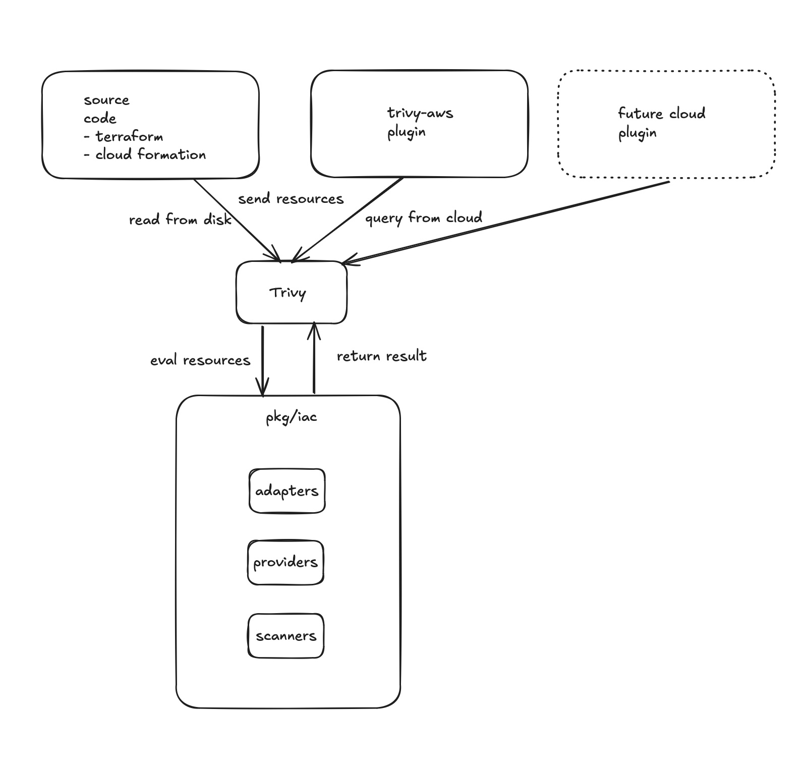
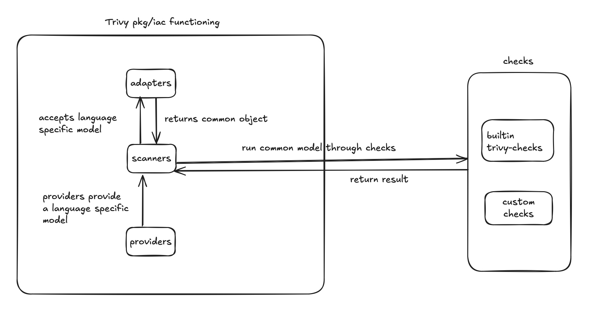

# Architecture

## Overview

The following diagram shows the high-level architecture of misconfiguration scanning.

```mermaid
graph TD;
tf[Terraform]
cf[CloudFormation]
aws[Live AWS Account]
k8s[Kubernetes YAML]
df[Dockerfiles]
k8sparser[Kubernetes Parser/Scanner]
dfparser[Dockerfile Parser/Scanner]
tfparser[Terraform Parser/Scanner]
cfparser[CloudFormation Parser/Scanner]
tfadapter[Terraform Adapter]
cfadapter[CloudFormation Adapter]
awsadapter[AWS Adapter]
checks[OPA Engine]
tf --> tfparser
cf --> cfparser
k8s --> k8sparser
df --> dfparser
tfparser --> tfadapter
cfparser --> cfadapter
aws --> awsadapter
tfadapter --> checks
cfadapter --> checks
awsadapter --> checks
k8sparser --> checks
dfparser --> checks
checks --> Result
```

## Component breakdown

Trivy Misconfiguration scanner can be divided into the following components as show below.

Trivy is able to obtain input from both IaC and Live Clouds when it comes to misconfiguration scanning. 
In the case of IaC scanning, language models such as Terraform and CloudFormation are used to build the common model.
For Live Cloud scanning, API calls are made directly to the Cloud provider and information is obtained. 

Ultimately, Trivy is able to "normalize" the various sources into a single common denominator which is the same across all input methods by which the resource could be constructed.

### `pkg/iac` directory

The `pkg/iac` components can be described as follows.

| Component | Description                                                                                                                                                                                 |
|-----------|---------------------------------------------------------------------------------------------------------------------------------------------------------------------------------------------|
| Adapters  | They are responsible for "adapting" language specific model and transforming it into a common object understood by Trivy                                                                    |
| Providers | Providers "provide" a language specific model to the scanners, thereby enabling the scanner to call the adapter to "adapt" into a common model                                              |
| Scanners  | Scanners take the input that providers provide and ask the adapters to adapt it into a common object. This common object is then run through with checks and finally the result is obtained |

Furthermore, misconfiguration scanning can be visualized with the following code flow chart.

