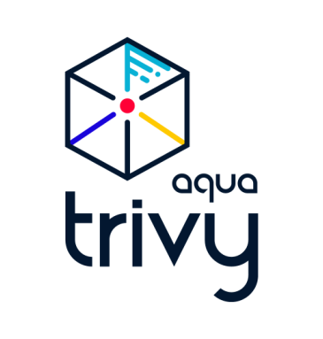

---
hide:
- navigation
- toc
---

{ align=left }

`Trivy` (`tri` pronounced like **tri**gger, `vy` pronounced like en**vy**) is a simple and comprehensive [vulnerability][vulnerability]/[misconfiguration][misconf] scanner for containers and other artifacts.
A software vulnerability is a glitch, flaw, or weakness present in the software or in an Operating System.
`Trivy` detects vulnerabilities of [OS packages][os] (Alpine, RHEL, CentOS, etc.) and [language-specific packages][lang] (Bundler, Composer, npm, yarn, etc.).
In addition, `Trivy` scans [Infrastructure as Code (IaC) files][iac] such as Terraform and Kubernetes, to detect potential configuration issues that expose your deployments to the risk of attack.
`Trivy` is easy to use. Just install the binary and you're ready to scan.
All you need to do for scanning is to specify a target such as an image name of the container.

    

    <h1 id="demo">Demo</h1>

<figure style="text-aligh: center">
  
  <figcaption>Demo: Vulnerability Detection</figcaption>
</figure>

<figure style="text-aligh: center">
  
  <figcaption>Demo: Misconfiguration Detection</figcaption>
</figure>

---

Trivy is an [Aqua Security][aquasec] open source project.  
Learn about our open source work and portfolio [here][oss].  
Contact us about any matter by opening a GitHub Discussion [here][discussions]

[vulnerability]: how-to-guides/vulnerability/scanning/index.md
[misconf]: how-to-guides/misconfiguration/index.md
[os]: how-to-guides/vulnerability/detection/os.md
[lang]: how-to-guides/vulnerability/detection/language.md
[iac]: how-to-guides/misconfiguration/iac.md

[aquasec]: https://aquasec.com
[oss]: https://www.aquasec.com/products/open-source-projects/
[discussions]: https://github.com/aquasecurity/trivy/discussions
